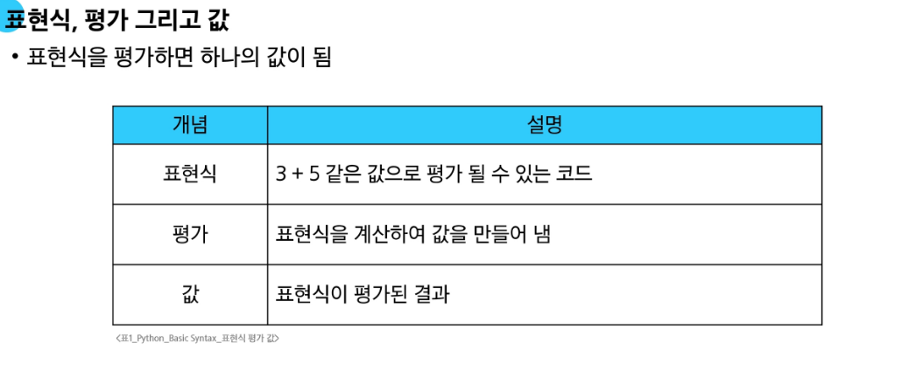
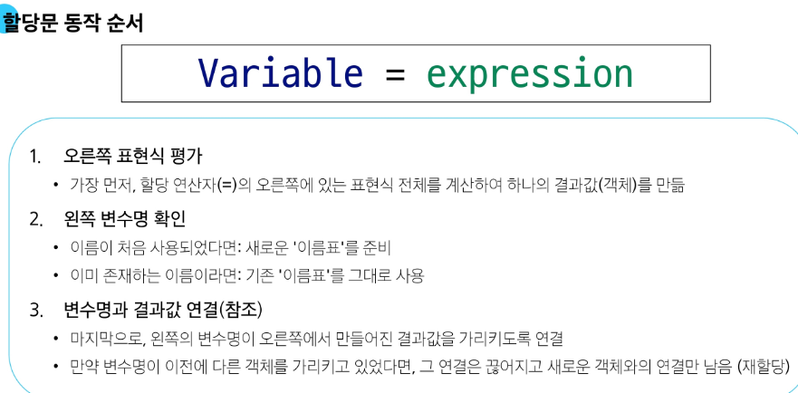
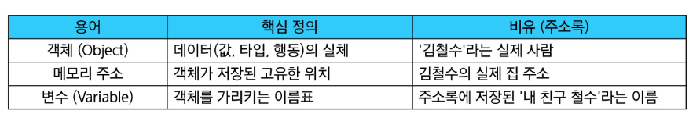

## 프로그램이란?

문제를 해결하기 위한 명령어들의 집합

순서대로 주어진 지시사항들이 명령어, 그것들이 모이면 하나의 프로그램이 된다.

### 프로그래밍의 핵심

- 새 연산을 정의하고 조합해 유용한 연산을 하는 것

※인터프리터 : 프로그래밍 언어를 기계어로 변환시켜주는 장치

인터프리터 실행법

1. python + i
2. python filename.py

### 변수

값을 **나중에 다시 사용**하기 위해, 그 값에 붙여주는 고유한 이름. (객체를 가리키는 이름)

**변수 할당** : 표현식이 만들어 낸 값에 이름을 붙이는 과정

ex) : degrees = 36.5 

degrees : 변수 이름

= : 할당 연산자(오른쪽 표현식의 평가 결과 값을 왼쪽 변수에 저장)

36.5 : 표현식 

**규칙**

- 영문 알파벳, 언더스코어(_), 숫자로 구성
- 숫자로 시작할 순 없음
- 대소문자를 구분
- 일부 키워드는 내부 예약어로서 변수명으로 사용을 못함.

### 메모리

메모리의 모든 위치에는 그 위치를 고유하게 식별하는 메모리 주소가 존재

- 고유한 ID(메모리 주소)
- 타입(Type) - 정수, 실수, 문자열 등등
- 값(Value)

값 + 타입 + 주소 정보를 묶은 것을 **객체(Object)** 라고 한다.

**변수**는 특정 객체를 가리키는 (refer / point to) 이름표

※변수는 메모리 주소를 **가지지(contain)** 않는다. 참조만 할 뿐이다.

**재할당**

- 변수는 특정 값을 기억하거나 가리키는 이름
- 재할당은 이 변수가 가리키는 대상을 새로운 값으로 변경하는 행위

**Data Types**

- 값의 종류와 그 값으로 할 수 있는 ‘동작(연산’) 을 결정하는 속성
- 각 타입에 따라 가능한 기능과 연산이 다르므로 데이터 타입이 필요

ex) 

숫자는 더하기 가능 

문자열은 결합 가능 

숫자와 문자는 서로 더할 수 없음 

**데이터 타입 분류 5가지**

1. Number Types - int(정수), float(실수)…
2. Text Sequence Type - str(문자열)
3. Sequence Types - list, tuple, range
4. Non-sequence Types - set, dict
5. 기타 - Boolean, None, Functions

**Number Types**

**Sequence Types**

여러개의 값들을 순서대로 나열하여 저장하는 자료형 

공통 특징은 다음과 같다.

1. 순서 - 값들이 순서대로 저장
2. 인덱싱 - 각 값에 고유 번호(인덱스)를 가지고 있으며, 인덱스를 사용하여 특정 위치의 값을 선택하거나 수정할 수 있음.
3. 슬라이싱- 인덱스 범위를 조절해 전체 데이터 중 원하는 부분만 값을 잘라낼 수 있음
4. 길이 - len() 함수를 사용하여 저장된 값의 개수(길이)를 구할 수 있음.
5. 반복 - 반복문을 사용하여 각 값을 하나씩 순서대로 꺼내 사용할 수 있음.

**Text Sequence Types**

문자들의 순서가 있는 변경 불가능한 시퀀스 자료형

**※인덱스(Index)**

시퀀스 자료형에서 각값의 위치를 식별하기 위해 부여된 고유한 번호 

프로그래밍에서 인덱스가 1이 아닌 0부터 시작하는 것은 거리개념으로 이해하면 쉽다. 

- 인덱스는 시작점으로부터 얼마나 떨어져 있는가를 의미
- 첫 번째 값은 시작점 그 자체이므로 떨어진 거리가 0
- 두 번쨰 값은 시작점에서 1만큼 떨어져 있음

**슬라이싱** 

시작 인덱스와 끝 인덱스를 지정하여 해당 범위의 값을 포함하는 새로운 시퀀스를 생성

대괄호 [] 안에 시작 위치, 끝 위치, 간격(step)을 콜론(:)으로 구분하여 지정

my_sequence{start:stop:step]

1. start : 슬라이싱을 시작할 인덱스
2. stop : 슬라이싱을 끝낼 인덱스
3. step : 몇 개씩 건너뛰며 값을 가져올지에 대한 간격 

처음을 생략하면 처음부터, 끝이 생략되면 끝까지, step이 생략되면 1칸씩 이동 

**문자열**

문자들의 순서가 있는 **변경 불가능한** 시퀀스 자료형

ex) str = ‘Hello’ , str[1] = ‘a’ >>이런식으로 변경 불가

단, new_str = str[0] + ‘a’ + str[2:]  같이 재할당하는건 가능

## 과제 제출 방법

1. 샘플 실행하기 
2. gitlab repo가 생성됨
3. gitlab repo를 clone
4. 풀고, add, commit → push
5. 실습실 환경에서 실습 제출하기까지 해야 과제 제출 완료